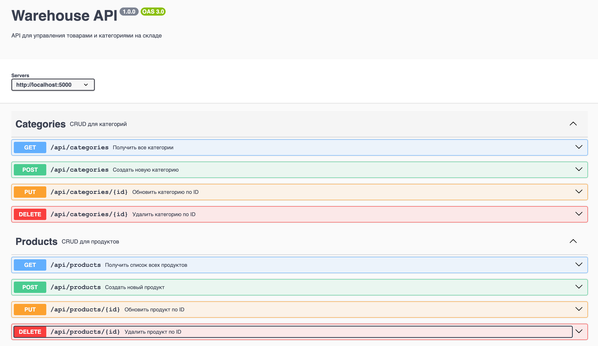

## Домашнее задание: "Реализация CRUD-операций для товаров и категорий на сервере"

* В проекте использую MongoDb
* В проекте есть docker-compose.yml, который разворачивает образ монги в контейнере
* Довалены валидации, логи, мидлвары
* Добавлена swagger спецификация
* Основное приложение маркетплейса использует теперь warehouse-backend для работы с данными (версия в ветке [use-warehouse-server](https://github.com/AnzhelikaLika20/MarketPlace-React/tree/use-warehouse-server))

